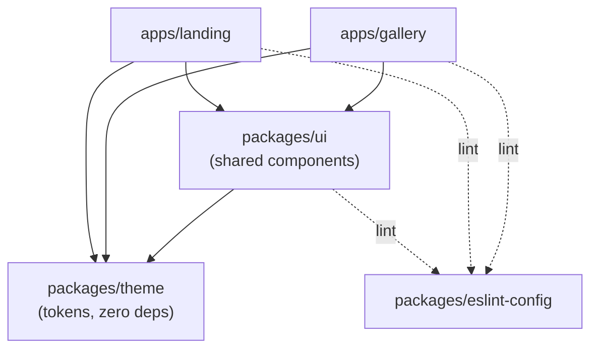
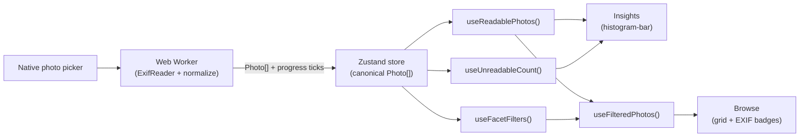

# Architecture Spine — BMAD Monorepo Product Suite

## Design Paradigm

**Layered monorepo, feature-sliced apps.** Two layers, one direction: `packages/theme` (design tokens, zero deps) → `packages/ui` (shared components, depends only on `theme`) → `apps/*` (consume `ui` + `theme`, never the reverse). Within `apps/gallery`, code is sliced by feature (`ingest/`, `insights/`, `browse/`, `photo-detail/`), not by file type — each feature owns its components, selectors, and logic; only the canonical store and the parsing worker are shared infrastructure beneath all features.



## Invariants & Rules

### AD-1 — One-way package dependency

- **Binds:** all (monorepo structure)
- **Prevents:** `packages/theme` or `packages/ui` importing from an app; an app bypassing `packages/ui` to hand-roll a component that duplicates one already shared.
- **Rule:** dependency direction is strictly `apps/* → packages/ui → packages/theme`. `packages/theme` has zero internal dependencies. A component used by two or more apps must live in `packages/ui`, never be copy-pasted (FR-2). The same `packages/eslint-config` import-boundary rule that enforces AD-3's feature split (see AD-3) also enforces this direction — CI-checked, not review-only.

### AD-2 — EXIF parsing is off-main-thread, via a single Web Worker, with a fixed message contract

- **Binds:** FR-5, FR-6, Ingest NFR (≤100 photos/batch, must not freeze the UI)
- **Prevents:** a chunked main-thread implementation that reintroduces jank on slow devices or large files; parsing logic duplicated between a worker path and a main-thread fallback path; the worker and its UI consumer independently inventing incompatible message shapes.
- **Rule:** `apps/gallery/src/worker` owns all EXIF extraction. It uses **ExifReader 4.41.0** — actively maintained (published 2026-06-08) with explicit HEIC/HEIF/AVIF/JPEG-XL support, vs. **exifr** 7.1.3, which also supports HEIC but has had no release since 2021-08 and so carries real risk of unpatched bugs against newer iPhone capture variants or EXIF edge cases (Lazy Cam is an iOS app defaulting to HEIC). The main thread only posts photo files/batches to the worker and never parses EXIF itself. The worker→main-thread message contract is fixed:

```typescript
type WorkerMessage =
  | { type: "progress"; done: number; total: number }
  | { type: "error"; fileName: string }
  | { type: "complete"; photos: Photo[] };
```

`progress` drives the Ingest-progress StatBar's `aria-live` count; `error` marks that one file as `readable: false` without halting the batch; `complete` ends the batch. Selecting more than 100 photos in one Ingest action is rejected by the `ingest` feature before any file reaches the worker (worker never sees an over-cap batch).

### AD-3 — Insights and Browse are structurally separate selectors over one canonical store

- **Binds:** FR-7, FR-8, EXPERIENCE.md's Insights/Browse split (Insights = full readable set always; Browse = Facet-filtered)
- **Prevents:** Insights accidentally reading filtered state (re-introducing the PRD §9 assumption this UX phase deliberately reversed); Browse and Insights each re-deriving the readable set with subtly different logic; a component reaching past the selector layer to the raw store.
- **Rule:** one Zustand store (`apps/gallery/src/store`) holds the full Ingested `Photo[]`; the store itself is **not exported** from the `store` module's public entry point — only selectors are. Three selectors exist, and `insights/` components may import **only** the first two:
  - `useReadablePhotos()` — `photos.filter(p => p.readable)`. Feeds every histogram-bar.
  - `useUnreadableCount()` — `photos.filter(p => !p.readable).length`. A count only, never the underlying photo objects — this is how Insights surfaces "N unreadable" without gaining access to raw or filtered state.
  - `useFacetFilters()` + `useFilteredPhotos()` (derived from `useReadablePhotos()` + active filters) — the only input `browse/` components may use.

  `packages/eslint-config` adds an import-boundary rule (e.g. `eslint-plugin-boundaries` or `dependency-cruiser`) enforcing: `insights/` may import from `store` (selectors only) and `packages/ui`, never from `browse/`; `browse/` may not import from `insights/`. This makes the boundary CI-checked, not review-only.

### AD-4 — The `Photo` entity is the one contract between Ingest, Insights, Browse, and Photo-detail

- **Binds:** FR-6, FR-7, FR-8
- **Prevents:** field-name/type drift between features built independently (e.g. one feature calling it `iso`, another `isoValue`).
- **Rule:**

```typescript
type Photo = {
  id: string;                 // stable per-Ingest-session id, not derived from filename
  readable: boolean;          // false => excluded from grid + Insights math, counted only
  focalLengthMm?: number;
  lensLabel?: string;         // display label, e.g. "24mm"
  iso?: number;
  apertureF?: number;
  shutterSpeedSec?: number;
  exposureCompEv?: number;
  capturedAt?: string;        // ISO-8601
  megapixelMode?: 12 | 48;    // derived, not read directly — see AD-6
  camera?: "front" | "rear";  // derived, not read directly — see AD-6
  thumbnailUrl: string;       // client-generated object URL, revoked only on full-session reset (never on "Add more")
};
```

`readable: false` means the worker found no usable EXIF/metadata block at all for that file (a whole-photo verdict — this is what excludes it from the grid and from every histogram's denominator). It is independent of individual fields: a `readable: true` photo can still be missing any single field (e.g. no exposure-comp tag present), in which case that field is `undefined`, never `null` or a sentinel. Per FR-7, a histogram-bar's percentage for a given field divides by the count of `readable: true` photos where *that specific field* is defined — not by the full readable count — so a field with patchy support doesn't silently skew against fully-readable photos.

The Browse grid-cell EXIF badge is pinned to exactly three fields, in this order: `focalLengthMm` (as `lensLabel`) · `apertureF` · `iso` — matching the mockup precedent (`mockups/gallery-browse.html`, e.g. "24mm · f/1.8 · ISO 200"). No other field combination is a valid badge; the full field list is reserved for Photo-detail-modal.

`thumbnailUrl` is created on the main thread via `URL.createObjectURL`, immediately after receiving each `Photo` from the worker's `complete` message (the worker passes back the underlying `Blob`/`File`, not a URL, since object URLs aren't guaranteed portable across execution contexts). It is revoked at exactly one trigger — an explicit full-session reset — and at no other point: not on Browse's "Clear filters," not on a tab switch, not on component unmount. This is what lets Insights and Browse (and an open Photo-detail modal) safely hold the same URL for the life of the session.

### AD-5 — Design tokens have one source; no arbitrary values downstream

- **Binds:** FR-1, FR-4, FR-11
- **Prevents:** either app (or `packages/ui`) hand-rolling a hex/spacing value that competes with the token set; visual drift between Gallery and Landing (SM-2).
- **Rule:** `packages/theme` exports the DESIGN.md token set as CSS custom properties (`--m-*`, light/dark) plus a Tailwind preset built on them; each app imports the CSS once at its root entry point (`main.tsx` / the Astro base layout), never per-component. `packages/eslint-config`'s `no-arbitrary-value` rule is applied in both apps and in `packages/ui`; it fails CI on any literal color/spacing value where a token exists, and it covers inline `style` props and CSS-in-JS, not just Tailwind class strings — a hex value smuggled through `style={{color: '#fff'}}` is exactly the escape hatch this rule exists to close.

### AD-6 — Megapixel-mode and camera-facing are derived fields, and their derivation is unit-tested

- **Binds:** FR-6
- **Prevents:** the derivation logic (resolution → 12/48MP; camera/lens EXIF tag → front/rear) silently breaking as ExifReader versions change or as edge-case files appear, with no test catching it.
- **Rule:** the raw-ExifReader-output → `Photo` normalization layer (`apps/gallery/src/worker/normalize.ts` or equivalent) is the one place this derivation happens, and it is covered by Vitest unit tests. No other file re-implements this derivation.

### AD-7 — Repeat Ingest ("Add more") appends and dedupes; the cap is cumulative

- **Binds:** FR-5, Ingest NFR (≤100 photos/batch)
- **Prevents:** two builders disagreeing on whether a second Ingest action replaces or grows the set, whether the 100-photo cap applies per-action or per-session, and whether re-selecting the same file twice double-counts it in Insights.
- **Rule:** a subsequent "Add more" Ingest action **appends** to the existing store; it never replaces it. The 100-photo cap is **cumulative for the session** (total store size, not per-action) — an Ingest action that would push the total over 100 is rejected with a message stating the limit, before any file reaches the worker (extends AD-2). Duplicate files across Ingest actions are deduped by `(fileName, size, lastModified)` — a duplicate is silently skipped, not re-added or double-counted. This resolves an assumption EXPERIENCE.md left open (its "Add more" control and the batch-exceeds-100 state); `EXPERIENCE.md` should be updated to reflect this rather than left as an open `[ASSUMPTION]`.

### AD-8 — Photo data never crosses a network boundary; no monitoring is configured

- **Binds:** PRD §10 Privacy NFR ("no analytics that capture image content"), FR-5, FR-6
- **Prevents:** an analytics/telemetry SDK — added later, for an unrelated reason — inadvertently reading `Photo` field values or file bytes; two epics wiring up monitoring inconsistently.
- **Rule:** the Web Worker's `postMessage` channel (AD-2) is the only path photo bytes or derived `Photo` fields travel, and it never leaves the tab. This is a test project with no deployment target, so no analytics/telemetry SDK is installed on either app. If one is added later, it must be page-view-only — no custom event may include a `Photo` field value or file content.

## Consistency Conventions

| Concern | Convention |
| --- | --- |
| Naming (entities, files, interfaces) | `Photo` is the one entity name across all features; feature folders (`ingest`, `insights`, `browse`, `photo-detail`) match the EXPERIENCE.md IA surface names exactly. |
| Data & formats | Dates: ISO-8601 strings on `Photo.capturedAt`. No raw EXIF objects cross a feature boundary — only normalized `Photo` records. |
| State & cross-cutting | Zustand is the only client state mechanism (no parallel Context-based state). All EXIF parsing goes through the worker (AD-2); no feature parses EXIF inline. Styling only through `packages/theme` tokens (AD-5) — never inline hex/px. No client-side router in either app — Gallery's Insights/Browse are `UnderlineTabs`-driven local state, not routes; Landing is a single static scroll page. |
| Accessibility | `packages/ui` components are keyboard-operable and semantically marked up by default (baseline per PRD §10 — not a formal WCAG AA commitment); this is the shared library's responsibility so no app has to re-derive it per component. |
| Lint / CI gate | `turbo lint` (incl. `no-arbitrary-value` and the AD-1/AD-3 import-boundary rule) + `turbo test` (Vitest, normalization layer) + `turbo build` run on every PR. |

## Stack

| Name | Version |
| --- | --- |
| pnpm | 11.10.0 |
| Turborepo | 2.10.3 |
| React | 19.2.7 |
| Vite | 8.1.3 |
| Astro | 7.0.6 |
| TypeScript | 6.0.3 |
| Zustand | 5.0.14 |
| ExifReader | 4.41.0 |
| Vitest | 4.1.10 |
| Storybook | 10.4.6 |

## Structural Seed

```text
{repo-root}/
  apps/
    gallery/                  # Vite + React SPA — mobile-first, client-side only
      src/
        app-shell/            # gates empty-state vs. populated shell; owns per-tab scroll position (AD-7)
        features/
          ingest/             # empty-state, photo picker trigger, Ingest-progress
          insights/           # histogram-bar rows, unreadable-count note
          browse/             # facet-panel, photo grid, EXIF-badge captions
          photo-detail/       # Modal + full Metadata Spec rows
        store/                # Zustand store (not exported directly) + useReadablePhotos/useUnreadableCount/useFilteredPhotos selectors (AD-3)
        worker/                # ExifReader parsing + normalize.ts (raw -> Photo, AD-2/AD-4/AD-6)
    landing/                  # Astro SSG — static, responsive
      src/
        pages/
        components/           # hero, pillar-card, preset-comparison (Landing-only)
  packages/
    theme/                    # CSS custom properties + Tailwind preset (AD-5)
    ui/                       # shared component library (Button, Field, HistogramBar, FacetPanel, ...); every exported component ships a co-located .stories.tsx (FR-3)
    eslint-config/            # no-arbitrary-value + shared lint rules
    tsconfig/                 # shared TS config
  turbo.json
  pnpm-workspace.yaml
```



## Capability → Architecture Map

| Capability / Area | Lives in | Governed by |
| --- | --- | --- |
| FR-1 Single-source Design tokens | `packages/theme` | AD-5 |
| FR-2 Shared component library | `packages/ui` | AD-1 |
| FR-3 Storybook-driven component development | `packages/ui` (co-located `.stories.tsx`) | Stack (Storybook) |
| FR-4 Token-usage enforcement | `packages/eslint-config` | AD-5 |
| FR-5 Manual photo Ingest | `apps/gallery/src/features/ingest` | AD-2 |
| FR-6 In-browser Metadata extraction | `apps/gallery/src/worker` | AD-2, AD-4, AD-6 |
| FR-7 Insights dashboard | `apps/gallery/src/features/insights` | AD-3, AD-4 |
| FR-8 Faceted filtering | `apps/gallery/src/features/browse` | AD-3, AD-4 |
| FR-10 Story-only marketing page | `apps/landing/src/pages` | — |
| FR-11 Built on shared Design System, responsive | `apps/landing` | AD-1, AD-5 |

## Deferred

- **Preset Facet + camera↔gallery Metadata bridge** — out of scope per PRD §6.2; no architecture commitment until Lazy Cam writes preset names to Metadata in a future phase.
- **E2E / component test suite** — only the EXIF normalization layer (AD-6) is tested now; broader test coverage (component tests, E2E) is left for a future pass if the project's scope grows past its current "deliberately lightweight" stance (PRD §7).
- **Turborepo remote caching / CI runner specifics** — no hosting target is configured for this test project; whether Turborepo remote cache is wired to GitHub Actions cache (or left unconfigured) is left to implementation.
- **GPS/location, Preset Facet, Gallery export/saved views** — all explicitly out of MVP scope per PRD §5/§6.2; no architecture surface needed for them.
- **Multi-worker / parallel parsing** — AD-2 fixes a single Web Worker as sufficient for ≤100 photos/batch; revisit only if the batch cap changes materially.
